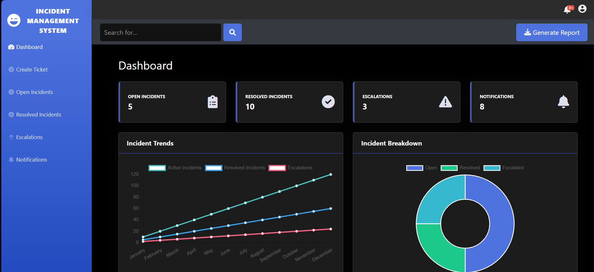

## Automated DevOps Incident Management Platform

### Project Description

This project is a ticket management system built using Django and Django REST framework for the backend and REACT for the front end. It provides functionalities for managing tickets including creating, reading, updating, and deleting tickets. Additionally, the project integrates with AWS services and uses Terraform for infrastructure provisioning.

  

*Screenshot displaying the front-end interface of the application.*

### Features
- **CRUD Operations:** Manage tickets with functionalities to create, read, update, and delete.
- **User Authentication:** Implement user management and role-based access control.
- **AWS Integration:** Utilize AWS SDK for interacting with cloud services.
- **Infrastructure as Code:** Use Terraform scripts to provision and manage cloud infrastructure.
- **Monitoring and Logging:** Set up Prometheus and Grafana for monitoring, and ELK stack for logging.
- **Ticket Categorization:** Categorize tickets based on severity, status, and type.
- **Incident Resolution Workflows:** Implement workflows for incident resolution including escalations, notifications, and documentation.

## Technologies Used

- **Backend**: Django, Django REST Framework, PostgreSQL
- **Frontend**: React
- **Infrastructure**: Terraform, AWS
- **Containerization and Deployment**: Docker, Ansible
- **Monitoring**: Prometheus, Grafana
